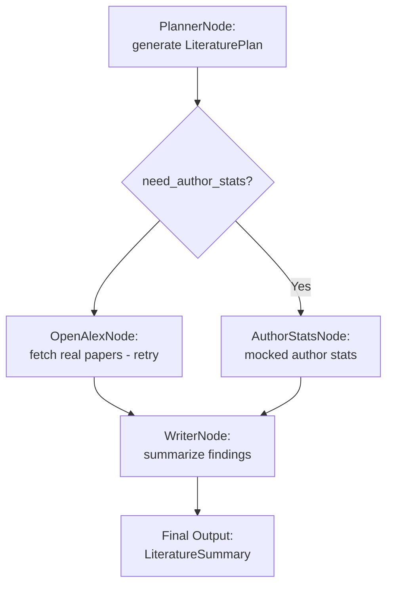

# ANLP2025 – Literature Review Agent (LangGraph + LangChain)

This project is part of **Lab #1** for the **ANLP2025** course.  
It implements a modular, multi-step LLM agent using **LangGraph** and **LangChain** to automate literature reviews.

---

##  What it does

Given a user query like:

> “Give me a short overview of recent work on quantum computing.”

The system performs the following steps:

1. Extracts a structured research plan.
2. Searches for recent papers using the OpenAlex API.
3. Optionally analyzes author statistics.
4. Summarizes the findings using a Large Language Model (LLM).

All results are returned as **structured JSON**, and a formatted version is shown in the Streamlit UI.

---

##  Features

- ✅ ReAct pattern (reason → act → observe)
- ✅ LLM agents with clear modular roles (Planner, Writer, Formatter)
- ✅ LangGraph graph structure with conditional routing
- ✅ Retry logic for external API calls (OpenAlex)
- ✅ Pydantic models for strict input/output validation
- ✅ Streamlit UI for interactive exploration

---

##  Project Structure

```text
anlp2025-lab1-jorge-sosa/
│
├── src/react_agent/
│   ├── graph.py        # LangGraph pipeline logic
│   ├── prompts.py      # LLM prompts for planner/writer/formatter
│   ├── tools.py        # External tool integrations (OpenAlex, stats)
│   ├── models.py       # Pydantic schemas for validation
│   ├── state.py        # Graph state definitions
│   ├── context.py      # Model context: keys, model type, etc.
│   ├── utils.py        # Shared helpers (e.g., load_chat_model)
│
├── tests/
│   └── test_graph.py   # Full end-to-end test
│
├── .env                # Environment variables (e.g., OpenAI API key)
├── requirements.txt    # Project dependencies
├── pyproject.toml      # Optional build config
├── langgraph.json      # LangGraph configuration (if used)
├── README.md           # This file
├── app.py              # Streamlit interface
```

---

##  Requirements

- Python **≥ 3.10**

Install dependencies:

```bash
pip install -r requirements.txt
```

Set up your `.env` file with your OpenAI API key:

```env
OPENAI_API_KEY=sk-...
```

---

## ▶ Running the Agent

### ➤ Option 1: Run via terminal (end-to-end test)

```bash
PYTHONPATH=src python -m tests.test_graph
```

### ➤ Option 2: Run with Streamlit UI

```bash
PYTHONPATH=src streamlit run app.py
```

Expected output (JSON format):

```json
{
  "topic": "Advances in Quantum Computing",
  "trends": ["..."],
  "notable_papers": ["..."],
  "open_questions": ["..."]
}
```

---

##  LangGraph Execution Flow



---

##  License

MIT License.

---

##  Author

Created by **Jorge Sosa** for the **ANLP2025** course, Lab 1.
