# ANLP2025 – Literature Review Agent & Multi-Agent System (LangGraph + LangChain)

This repository contains the code for **Lab 1** and **Lab 2** of the **ANLP2025** course.

* **Lab 1**: a modular LLM-based **Literature Review Agent** using LangGraph + LangChain + OpenAlex.
* **Lab 2**: a **Multi-Agent Study & Productivity Assistant (MAS)** that reuses the Lab 1 graph as a specialized research agent inside a router-based multi-agent architecture.

---

## 📌 Lab 1 – Literature Review Agent

Given a user query like:

> “Give me a short overview of recent work on quantum computing.”

the system:

1. Extracts a **structured research plan** (keywords, year filter, need for author stats).
2. Searches for **recent papers** using the OpenAlex API.
3. Optionally analyzes **author statistics** (mocked tool).
4. Summarizes the findings using a **Large Language Model (LLM)**.
5. Produces both:

   * A **JSON summary** (`LiteratureSummary`).
   * A **formatted natural-language report** (via a Formatter LLM).

All intermediate steps use **Pydantic models** as data contracts.

### ✨ Lab 1 Features

* ✅ ReAct-style pattern (reason → act → observe → reason again)
* ✅ LLM agents with clear roles:

  * **Planner** → builds `LiteraturePlan`
  * **Writer** → builds `LiteratureSummary`
  * **Formatter** → converts JSON summary to a human-readable paragraph
* ✅ LangGraph `StateGraph` with:

  * Parallel tool branches (`openalex` + `author_stats`)
  * State merging before the writer node
* ✅ Retry logic (`tenacity`) for external API calls to OpenAlex
* ✅ Pydantic models for strict input/output validation
* ✅ Streamlit UI for interactive exploration

---

## 🤖 Lab 2 – Multi-Agent Study & Productivity Assistant (MAS)

In Lab 2, the LangGraph workflow from Lab 1 is reused as a **specialized research agent** inside a Multi-Agent System that can route queries to different “experts”.

### What the MAS does

Given a free-form query, for example:

* “Give me a summary of recent research on quantum computing.”
* “Explain what a multi-agent system is.”
* “Help me plan the next steps for this lab.”

the MAS:

1. Uses a **RouterAgent** to classify the query into:

   * `research`
   * `theory`
   * `coding` / `planning`
2. Delegates the query to one of several specialized agents:

   * **ResearchAgent** – wraps the Lab 1 literature graph.
   * **TheoryAgent** – explains concepts and theory.
   * **CodingAgent** – provides implementation / planning help.
3. Consolidates the answer in a **FinalFormatter** node that produces `final_answer`.
4. Tracks which agents and tools were used, and stores lightweight **memory** about past queries.

### MAS Agents and Responsibilities

* **RouterAgent**
  Simple intent classifier based on keywords. Implements the *router + specialists* pattern.

* **ResearchAgent**
  Specialized in scientific literature review. Internally:

  * Builds an `InputState` with a `HumanMessage`.
  * Creates a `Context(model="qwen3-32b", max_search_results=15)`.
  * Calls `graph.ainvoke(...)` from `react_agent.graph` (the Lab 1 graph).
  * Normalizes the result into:

    * `plan`
    * `summary_json`
    * `formatted_report`
    * `papers`
      The `formatted_report` is stored in `draft_answer`.

* **TheoryAgent**
  Handles conceptual questions (e.g. “What is LangGraph?”, “What is a MAS?”).
  Produces explanatory text and appends a record to shared `memory`.

* **CodingAgent**
  Handles implementation / planning queries (code hints, TODO lists, next steps).
  Writes a short plan and also appends to `memory`.

* **FinalFormatter**
  Reads `draft_answer` and copies it into `final_answer`.
  It is always the last node executed.

---

## 🧱 Shared State (MASState)

All agents communicate through a shared LangGraph state `MASState` (a TypedDict) with fields such as:

* `user_query`: current user input
* `query_type`: `"research" | "theory" | "coding" | "planning"`
* `research_result`: raw JSON-like output from the Lab 1 graph
* `draft_answer`: intermediate answer from a specialist agent
* `final_answer`: final answer returned to the user
* `agents_visited`: list of executed agent names
* `tools_used`: list of external tools called (e.g. `["run_research_assistant"]`)
* `memory`: list of `{query, answer, type}` objects for simple conversational memory

Each agent reads and writes only the fields it needs. For example:

* `ResearchAgent` updates `research_result`, `draft_answer`, `agents_visited`, `tools_used`, and appends to `memory`.
* `FinalFormatter` only reads `draft_answer` and writes `final_answer`.

---

## 🗂 Project Structure

```text
react-agent-streamlit-LLM/
│
├── src/
│   ├── react_agent/
│   │   ├── graph.py        # LangGraph pipeline logic (Lab 1)
│   │   ├── prompts.py      # LLM prompts for planner/writer/formatter
│   │   ├── tools.py        # External tools (OpenAlex, stats)
│   │   ├── models.py       # Pydantic schemas for validation
│   │   ├── state.py        # Graph state definitions (Lab 1)
│   │   ├── context.py      # Model context: keys, model type, etc.
│   │   └── utils.py        # Shared helpers
│   │
│   ├── mas_agent/
│   │   ├── __init__.py
│   │   ├── state.py        # MASState definition (shared MAS state)
│   │   ├── tools.py        # run_research_assistant wrapper (uses Lab 1 graph)
│   │   ├── agents.py       # RouterAgent, ResearchAgent, TheoryAgent, CodingAgent, FinalFormatter
│   │   └── graph.py        # MAS LangGraph (router + specialists)
│   │
│   └── ...
│
├── tests/
│   └── test_graph.py       # Full end-to-end test for Lab 1 graph
│
├── .env                    # Environment variables (API keys, endpoints)
├── requirements.txt        # Project dependencies
├── pyproject.toml          # Optional build config
├── langgraph.json          # LangGraph configuration (if used)
├── README.md               # This file
├── app.py                  # Streamlit interface (Lab 1 UI)
└── ...
```

---

## 📦 Requirements

* Python **≥ 3.10**

Create a virtual environment and install dependencies:

```bash
python -m venv .venv
source .venv/bin/activate          # On Windows: .venv\Scripts\activate
python -m pip install -r requirements.txt
```

Set up your `.env` (or environment variables) with your model / API configuration.
Example for OpenAI:

```env
OPENAI_API_KEY=sk-...
OPENAI_BASE_URL=https://api.openai.com/v1
```

For the course setup, `Context` may also be configured to use a university-hosted endpoint (e.g. Qwen models behind VPN).

---

## ▶ Running the Code

### 🔹 Lab 1: Literature Review Agent (terminal)

```bash
PYTHONPATH=src python -m tests.test_graph
```

This will:

* Run the LangGraph workflow on a sample quantum-computing query.
* Print:

  * The extracted `LiteraturePlan`.
  * The JSON `LiteratureSummary`.
  * The final formatted report.

### 🔹 Lab 2: Multi-Agent System (MAS) demo

```bash
PYTHONPATH=src python -m mas_agent.graph
```

This will:

* Build and run the MAS graph with a default example query.
* Execute:

  * `RouterAgent` → decides `research`.
  * `ResearchAgent` → calls `run_research_assistant` (Lab 1 graph).
  * `FinalFormatter` → produces `final_answer`.
* Print:

  * The final answer.
  * Which agents were visited.
  * Which tools were used.

You can change the example query in `mas_agent/graph.py` to test different routing decisions (e.g. theory vs coding).

### 🔹 Optional: Streamlit UI (Lab 1)

```bash
python -m streamlit run app.py
```

Open the URL shown in terminal (e.g. `http://localhost:8501`) and:

1. Enter a query.
2. Run the agent.
3. Inspect:

   * The extracted `LiteraturePlan`.
   * The JSON `LiteratureSummary`.
   * The formatted report.

Example of JSON summary:

```json
{
  "topic": "Advances in Quantum Computing",
  "trends": ["..."],
  "notable_papers": ["..."],
  "open_questions": ["..."]
}
```

---

## 🧠 LangGraph Execution Flow – Lab 1

```mermaid
graph TD
  A["Planner Node (LLM → LiteraturePlan)"] --> B["OpenAlex Node (fetch_papers_with_retry)"]
  A --> C["AuthorStats Node (fetch_author_stats or None)"]

  B --> D["Writer Node (LLM → LiteratureSummary)"]
  C --> D

  D --> E["Formatter Node (LLM → formatted text)"]
```



## 🧠 LangGraph Execution Flow – Lab 2 (MAS)


---

## 🧪 Experiments and Informal Evaluation

We ran the MAS on several queries (at least five) to see how routing, tools, and memory behave in practice.

### 1. Conceptual / Theoretical query (MAS / LLM agents)

**Query**

> “What is a multi-agent system in the context of LLMs?”

**Agents / nodes activated (in order)**  
`RouterAgent → TheoryAgent → FinalFormatter`

**Tools used**  
None.

**Memory usage**  
A record `{query, answer, type="theory"}` was appended to `memory`.

**Notes**  
Routing was correct and the explanation was clear and high-level, focused on MAS patterns and examples. No tool calls were needed.

---

### 2. Architecture / design query

**Query**

> “Describe the architecture of this MAS and how agents communicate.”

**Agents / nodes activated**  
`RouterAgent → TheoryAgent → FinalFormatter`

**Tools used**  
None.

**Memory usage**  
Another record was stored in `memory` with `type="architecture"`.

**Notes**  
The system correctly treated this as a theory/architecture question. The answer described `MASState`, the router + specialists pattern, and the flow of messages. Useful to understand the design.

---

### 3. Implementation / coding query

**Query**

> “How can I extend this code to add a new planning agent?”

**Agents / nodes activated**  
`RouterAgent → CodingAgent → FinalFormatter`

**Tools used**  
None.

**Memory usage**  
A record with `type="coding"` was appended, including a short plan for future reference.

**Notes**  
Routing switched to `CodingAgent`, which produced a step-by-step plan (new node, state fields, router update). This showed that the system can give concrete implementation advice distinct from theory explanations.

---

### 4. Study / productivity query

**Query**

> “Help me plan a study schedule for the ANLP2025 course.”

**Agents / nodes activated**  
`RouterAgent → CodingAgent → FinalFormatter`

**Tools used**  
None (only the LLM).

**Memory usage**  
The schedule and query were stored as a `memory` entry, which could later be reused to adapt future suggestions.

**Notes**  
The answer contained a structured weekly plan (topics, reading, coding time). Routing to `CodingAgent` worked well for this “planning / productivity” use case.

---

### 5. Research / literature query

**Query**

> “Give me a short overview of recent work on quantum computing.”

**Agents / nodes activated**  
`RouterAgent → ResearchAgent → FinalFormatter`

**Tools used**  
- `run_research_assistant` (wrapped Lab 1 literature graph).  
  The underlying graph called OpenAlex (via the Lab 1 tools) and produced:
  - a `LiteraturePlan`,
  - a list of papers,
  - a structured `LiteratureSummary`,
  - and a formatted report.

**Memory usage**  
A `memory` entry stored the query, the final summary, and `type="research"`.

**Notes**  
This query exercised the full tool-calling path. Routing to `ResearchAgent` was correct, and the answer combined real paper metadata with a coherent summary.

---

### Informal evaluation

Overall, the MAS behaved as expected:

- **Routing quality** – RouterAgent consistently chose the right specialist:
  - theory / architecture questions → `TheoryAgent`,
  - coding / planning queries → `CodingAgent`,
  - research queries → `ResearchAgent`.
- **Tool usage** – External tool calls only happened inside `ResearchAgent`, via `run_research_assistant`, which reuses the Lab 1 graph and OpenAlex integration. This kept tool usage localized and easy to reason about.
- **Memory** – The `memory` list collects lightweight records of `{query, answer, type}`. In the current version, memory is mainly *diagnostic* (for inspection and future extensions), but already provides a simple history that could be used by additional agents.
- **Usefulness** – For the tested queries, answers were generally correct and practically useful: good conceptual explanations, clear architecture description, concrete coding guidance, and realistic study / research suggestions.

Limitations observed:

- The router is keyword-based and can be confused by very ambiguous queries.
- Memory is not yet used to adapt responses across turns (no retrieval / personalization).
- Only one external tool (literature review) is implemented; other tools (calendar, filesystem, etc.) could be added.

---

## 🪞 Reflection

**What worked well**

- The **router + specialists** pattern made the system easy to understand and extend. Each agent has a clear responsibility (research, theory, coding/planning, final formatting).
- Reusing the **Lab 1 literature graph** inside `ResearchAgent` avoided code duplication and shows how a single specialized agent can be embedded into a larger MAS.
- LangGraph’s **typed state** (`MASState`) simplified handoff and logging of which agents and tools were used.
- The minimal **memory** mechanism is simple but already provides a basis for future personalization or history-aware behavior.

**What was less successful / limitations**

- The **RouterAgent** currently relies on simple heuristics and keywords; it can misclassify edge-case queries or multi-intent questions.
- The system stores memory but **does not actively use it** to condition future answers (no retrieval, summarization, or long-term profile).
- Tool calling is limited to a **single research tool**; other realistic tools (e.g. code execution, local notes search, scheduling) are not yet integrated.
- There is no explicit error-handling agent; failures in tools or LLM calls are only partially surfaced.

**Possible future extensions**

- Replace the heuristic router with an **LLM-based classifier node** that considers the full query and the current memory.
- Add a dedicated **PlanningAgent** that takes the current query and memory and proposes follow-up tasks or next steps (e.g. study checklist, coding TODO list).
- Turn the `memory` list into a small **RAG-style store** (e.g. vector embeddings over notes) so that agents can retrieve relevant past context when answering.
- Introduce additional tools, such as:
  - a tiny local knowledge base of course notes,
  - a code-execution tool for small Python snippets,
  - or a file/notes search tool.
- Add better **logging and visualization** of the MAS run (for example, recording each node transition and rendering it as a sequence diagram).

This reflection shows that, while the current version already demonstrates MAS patterns, tool calling, and basic memory, there is a clear path to turning it into a more powerful and realistic assistant for study and productivity tasks.


## 🧾 License

MIT License.

---

## 👤 Author

Created by **Jorge Sosa** for the **ANLP2025** course.

* Lab 1: Literature Review Agent
* Lab 2: Multi-Agent Study & Productivity Assistant (MAS)
