# ANLP2025 – Literature Review Agent & Multi-Agent System (LangGraph + LangChain)

This repository contains the code for **Lab 1** and **Lab 2** of the **ANLP2025** course.

* **Lab 1**: a modular LLM-based **Literature Review Agent** using LangGraph + LangChain + OpenAlex.
* **Lab 2**: a **Multi-Agent Study & Productivity Assistant (MAS)** that reuses the Lab 1 graph as a specialized research agent inside a router-based multi-agent architecture.

---

## 📌 Lab 1 – Literature Review Agent

Given a user query like:

> “Give me a short overview of recent work on quantum computing.”

the system:

1. Extracts a **structured research plan** (keywords, year filter, need for author stats).
2. Searches for **recent papers** using the OpenAlex API.
3. Optionally analyzes **author statistics** (mocked tool).
4. Summarizes the findings using a **Large Language Model (LLM)**.
5. Produces both:

   * A **JSON summary** (`LiteratureSummary`).
   * A **formatted natural-language report** (via a Formatter LLM).

All intermediate steps use **Pydantic models** as data contracts.

### ✨ Lab 1 Features

* ✅ ReAct-style pattern (reason → act → observe → reason again)
* ✅ LLM agents with clear roles:

  * **Planner** → builds `LiteraturePlan`
  * **Writer** → builds `LiteratureSummary`
  * **Formatter** → converts JSON summary to a human-readable paragraph
* ✅ LangGraph `StateGraph` with:

  * Parallel tool branches (`openalex` + `author_stats`)
  * State merging before the writer node
* ✅ Retry logic (`tenacity`) for external API calls to OpenAlex
* ✅ Pydantic models for strict input/output validation
* ✅ Streamlit UI for interactive exploration

---

## 🤖 Lab 2 – Multi-Agent Study & Productivity Assistant (MAS)

In Lab 2, the LangGraph workflow from Lab 1 is reused as a **specialized research agent** inside a Multi-Agent System that can route queries to different “experts”.

### What the MAS does

Given a free-form query, for example:

* “Give me a summary of recent research on quantum computing.”
* “Explain what a multi-agent system is.”
* “Help me plan the next steps for this lab.”

the MAS:

1. Uses a **RouterAgent** to classify the query into:

   * `research`
   * `theory`
   * `coding` / `planning`
2. Delegates the query to one of several specialized agents:

   * **ResearchAgent** – wraps the Lab 1 literature graph.
   * **TheoryAgent** – explains concepts and theory.
   * **CodingAgent** – provides implementation / planning help.
3. Consolidates the answer in a **FinalFormatter** node that produces `final_answer`.
4. Tracks which agents and tools were used, and stores lightweight **memory** about past queries.

### MAS Agents and Responsibilities

* **RouterAgent**
  Simple intent classifier based on keywords. Implements the *router + specialists* pattern.

* **ResearchAgent**
  Specialized in scientific literature review. Internally:

  * Builds an `InputState` with a `HumanMessage`.
  * Creates a `Context(model="qwen3-32b", max_search_results=15)`.
  * Calls `graph.ainvoke(...)` from `react_agent.graph` (the Lab 1 graph).
  * Normalizes the result into:

    * `plan`
    * `summary_json`
    * `formatted_report`
    * `papers`
      The `formatted_report` is stored in `draft_answer`.

* **TheoryAgent**
  Handles conceptual questions (e.g. “What is LangGraph?”, “What is a MAS?”).
  Produces explanatory text and appends a record to shared `memory`.

* **CodingAgent**
  Handles implementation / planning queries (code hints, TODO lists, next steps).
  Writes a short plan and also appends to `memory`.

* **FinalFormatter**
  Reads `draft_answer` and copies it into `final_answer`.
  It is always the last node executed.

---

## 🧱 Shared State (MASState)

All agents communicate through a shared LangGraph state `MASState` (a TypedDict) with fields such as:

* `user_query`: current user input
* `query_type`: `"research" | "theory" | "coding" | "planning"`
* `research_result`: raw JSON-like output from the Lab 1 graph
* `draft_answer`: intermediate answer from a specialist agent
* `final_answer`: final answer returned to the user
* `agents_visited`: list of executed agent names
* `tools_used`: list of external tools called (e.g. `["run_research_assistant"]`)
* `memory`: list of `{query, answer, type}` objects for simple conversational memory

Each agent reads and writes only the fields it needs. For example:

* `ResearchAgent` updates `research_result`, `draft_answer`, `agents_visited`, `tools_used`, and appends to `memory`.
* `FinalFormatter` only reads `draft_answer` and writes `final_answer`.

---

## 🗂 Project Structure

```text
react-agent-streamlit-LLM/
│
├── src/
│   ├── react_agent/
│   │   ├── graph.py        # LangGraph pipeline logic (Lab 1)
│   │   ├── prompts.py      # LLM prompts for planner/writer/formatter
│   │   ├── tools.py        # External tools (OpenAlex, stats)
│   │   ├── models.py       # Pydantic schemas for validation
│   │   ├── state.py        # Graph state definitions (Lab 1)
│   │   ├── context.py      # Model context: keys, model type, etc.
│   │   └── utils.py        # Shared helpers
│   │
│   ├── mas_agent/
│   │   ├── __init__.py
│   │   ├── state.py        # MASState definition (shared MAS state)
│   │   ├── tools.py        # run_research_assistant wrapper (uses Lab 1 graph)
│   │   ├── agents.py       # RouterAgent, ResearchAgent, TheoryAgent, CodingAgent, FinalFormatter
│   │   └── graph.py        # MAS LangGraph (router + specialists)
│   │
│   └── ...
│
├── tests/
│   └── test_graph.py       # Full end-to-end test for Lab 1 graph
│
├── .env                    # Environment variables (API keys, endpoints)
├── requirements.txt        # Project dependencies
├── pyproject.toml          # Optional build config
├── langgraph.json          # LangGraph configuration (if used)
├── README.md               # This file
├── app.py                  # Streamlit interface (Lab 1 UI)
└── ...
```

---

## 📦 Requirements

* Python **≥ 3.10**

Create a virtual environment and install dependencies:

```bash
python -m venv .venv
source .venv/bin/activate          # On Windows: .venv\Scripts\activate
python -m pip install -r requirements.txt
```

Set up your `.env` (or environment variables) with your model / API configuration.
Example for OpenAI:

```env
OPENAI_API_KEY=sk-...
OPENAI_BASE_URL=https://api.openai.com/v1
```

For the course setup, `Context` may also be configured to use a university-hosted endpoint (e.g. Qwen models behind VPN).

---

## ▶ Running the Code

### 🔹 Lab 1: Literature Review Agent (terminal)

```bash
PYTHONPATH=src python -m tests.test_graph
```

This will:

* Run the LangGraph workflow on a sample quantum-computing query.
* Print:

  * The extracted `LiteraturePlan`.
  * The JSON `LiteratureSummary`.
  * The final formatted report.

---

### 🔹 Lab 2: Multi-Agent System (MAS) demo

```bash
PYTHONPATH=src python -m mas_agent.graph
```

This will:

* Build and run the MAS graph with a default example query.
* Execute:

  * `RouterAgent` → decides `research`.
  * `ResearchAgent` → calls `run_research_assistant` (Lab 1 graph).
  * `FinalFormatter` → produces `final_answer`.
* Print:

  * The final answer.
  * Which agents were visited.
  * Which tools were used.

You can change the example query in `mas_agent/graph.py` to test different routing decisions (e.g. theory vs coding).

---

### 🔹 Optional: Streamlit UI (Lab 1)

```bash
python -m streamlit run app.py
```

Open the URL shown in terminal (e.g. `http://localhost:8501`) and:

1. Enter a query.
2. Run the agent.
3. Inspect:

   * The extracted `LiteraturePlan`.
   * The JSON `LiteratureSummary`.
   * The formatted report.

Example of JSON summary:

```json
{
  "topic": "Advances in Quantum Computing",
  "trends": ["..."],
  "notable_papers": ["..."],
  "open_questions": ["..."]
}
```

---

## 🛠 Tool Calling and Memory Usage

This MAS uses **tool calling** and **memory** explicitly:

* **Tool calling**

  * The only external tool is `run_research_assistant` (defined in `src/mas_agent/tools.py`).
  * It is called **only by `ResearchAgent`**, when the router classifies the query as `research`.
  * Internally, this tool:

    * Wraps the LangGraph from **Lab 1** (`react_agent.graph`),
    * Builds an `InputState` with the user query,
    * Invokes the literature-review graph (OpenAlex + LLM summarization),
    * Returns:

      * the extracted `LiteraturePlan`,
      * the JSON `LiteratureSummary`,
      * the formatted report,
      * and the list of retrieved papers.

* **Memory**

  * The shared state `MASState` contains a `memory` field:

    ```python
    memory: List[Dict[str, Any]]
    ```
  * Each agent can append lightweight history entries of the form:

    ```json
    {
      "query": "...",
      "answer": "...",
      "type": "research | theory | coding"
    }
    ```
  * This is used as a **short-term session memory**:

    * The router and specialist agents can look at recent entries to keep answers consistent.
    * It also allows future extensions (e.g. show last queries in a UI or do simple retrieval).

---

## 🧠 LangGraph Execution Flow – Lab 1

```mermaid
graph TD
  A["Planner Node (LLM → LiteraturePlan)"] --> B["OpenAlex Node (fetch_papers_with_retry)"]
  A --> C["AuthorStats Node (fetch_author_stats or None)"]

  B --> D["Writer Node (LLM → LiteratureSummary)"]
  C --> D

  D --> E["Formatter Node (LLM → formatted text)"]
```



---

## 🧠 LangGraph Execution Flow – Lab 2 (MAS)


---

## 🧪 Experiments and Informal Evaluation

I ran the MAS on several queries to test routing, tool calling, and memory behaviour.
The table below summarises representative queries:

| # | Query                                                           | Expected route                  | Actual agents used (from `agents_visited`)           | Tools used                   | Notes on usefulness / behaviour                                                                                        |
| - | --------------------------------------------------------------- | ------------------------------- | ---------------------------------------------------- | ---------------------------- | ---------------------------------------------------------------------------------------------------------------------- |
| 1 | “Give me a short overview of recent work on quantum computing.” | `research` → ResearchAgent      | `["RouterAgent", "ResearchAgent", "FinalFormatter"]` | `["run_research_assistant"]` | Correctly routed to research. Tool called Lab 1 graph, good summary and open questions.                                |
| 2 | “Explain what a multi-agent system is.”                         | `theory` → TheoryAgent          | `["RouterAgent", "TheoryAgent", "FinalFormatter"]`   | `[]`                         | No tools needed. TheoryAgent produced a clear conceptual explanation.                                                  |
| 3 | “Help me plan the next steps for this lab.”                     | `coding/planning` → CodingAgent | `["RouterAgent", "CodingAgent", "FinalFormatter"]`   | `[]`                         | Produced a step-by-step plan (tests, README polish, more experiments).                                                 |
| 4 | “Summarize recent work on quantum error correction with ML.”    | `research` → ResearchAgent      | `["RouterAgent", "ResearchAgent", "FinalFormatter"]` | `["run_research_assistant"]` | Similar to query 1 but with a narrower topic. Retrieved different papers; routing and tool calling worked as expected. |
| 5 | “Why do we use LangGraph instead of plain LangChain chains?”    | `theory` → TheoryAgent          | `["RouterAgent", "TheoryAgent", "FinalFormatter"]`   | `[]`                         | Answer highlighted advantages of graph-based orchestration (branches, state merging).                                  |
| 6 | “What coding tasks should I prioritise this week for ANLP?”     | `coding/planning` → CodingAgent | `["RouterAgent", "CodingAgent", "FinalFormatter"]`   | `[]`                         | Produced a prioritised TODO list. Memory of previous queries could be used to keep consistency in future extensions.   |

### Informal evaluation

* **Routing correctness**

  * For the tested queries, routing matched expectations (`research`, `theory`, `coding/planning`).
  * The simple keyword-based router is enough for this lab, but for ambiguous queries a more advanced classifier could be useful.

* **Tool usage**

  * `run_research_assistant` was only triggered for research-type questions.
  * The integration with the Lab 1 graph behaved as expected: it returned a structured summary and formatted report without breaking the MAS flow.

* **Memory**

  * The current `memory` field is intentionally minimal (a list of `{query, answer, type}`).
  * It is sufficient to record past interactions and could be used later for retrieval or personalised hints.
  * For this lab I mostly read memory implicitly (for debugging/inspection), but the design leaves room for extensions.

* **Overall usefulness**

  * The system is already helpful as a **study & productivity assistant**:

    * It can quickly get literature summaries via the research agent.
    * It answers conceptual questions via the theory agent.
    * It produces short plans and TODO lists via the coding agent.

---

## 🪞 Reflection

### What worked well

* The **router + specialists** pattern fits the scenario nicely:

  * RouterAgent keeps the top-level logic simple.
  * Each specialist agent has a clear responsibility (research, theory, coding/planning).
* Reusing the **Lab 1 literature graph** as a tool (`run_research_assistant`) worked very well:

  * I did not need to re-implement the literature workflow.
  * The MAS treats it as a black box that returns a plan, a JSON summary and a formatted report.
* Using a **shared LangGraph state (`MASState`)** made it straightforward to:

  * Track which agents and tools were used.
  * Pass intermediate results (e.g. research outputs) to the final formatter.

### Where the system is limited

* The **router** is intentionally simple (keyword-based), so:

  * It might misclassify more ambiguous or mixed queries.
  * It does not yet look at past memory, only at the current query.
* The **memory** mechanism is minimal:

  * Just a list of small dictionaries; no retrieval, no vector store.
  * It is enough for logging and simple inspection, but not for long-term personalised behaviour.
* Tool calling is currently **focused on a single tool** (`run_research_assistant`):

  * There is no integration yet with other tools (e.g. file search, calendar, code execution).

### Possible future extensions

* Improve routing with a **small LLM-based classifier node** that:

  * Looks at both the current query and recent memory.
  * Can route to multiple agents for more complex tasks.
* Extend memory to a **RAG-style history**:

  * Store previous notes and answers.
  * Allow the MAS to retrieve relevant past information when answering.
* Add more tools and agents, for example:

  * A “notes” tool for saving and retrieving study notes.
  * A scheduling/planning tool for deadlines.
  * A reviewer agent that critiques the answers of other agents.
* Expose the MAS through a richer UI (e.g. Streamlit) where:

  * The user can see which agents were activated.
  * The history/memory and tool calls are visualised for debugging and learning.

---

## 🧾 License

MIT License.

---

## 👤 Author

Created by **Jorge Sosa** for the **ANLP2025** course.

* Lab 1: Literature Review Agent
* Lab 2: Multi-Agent Study & Productivity Assistant (MAS)
